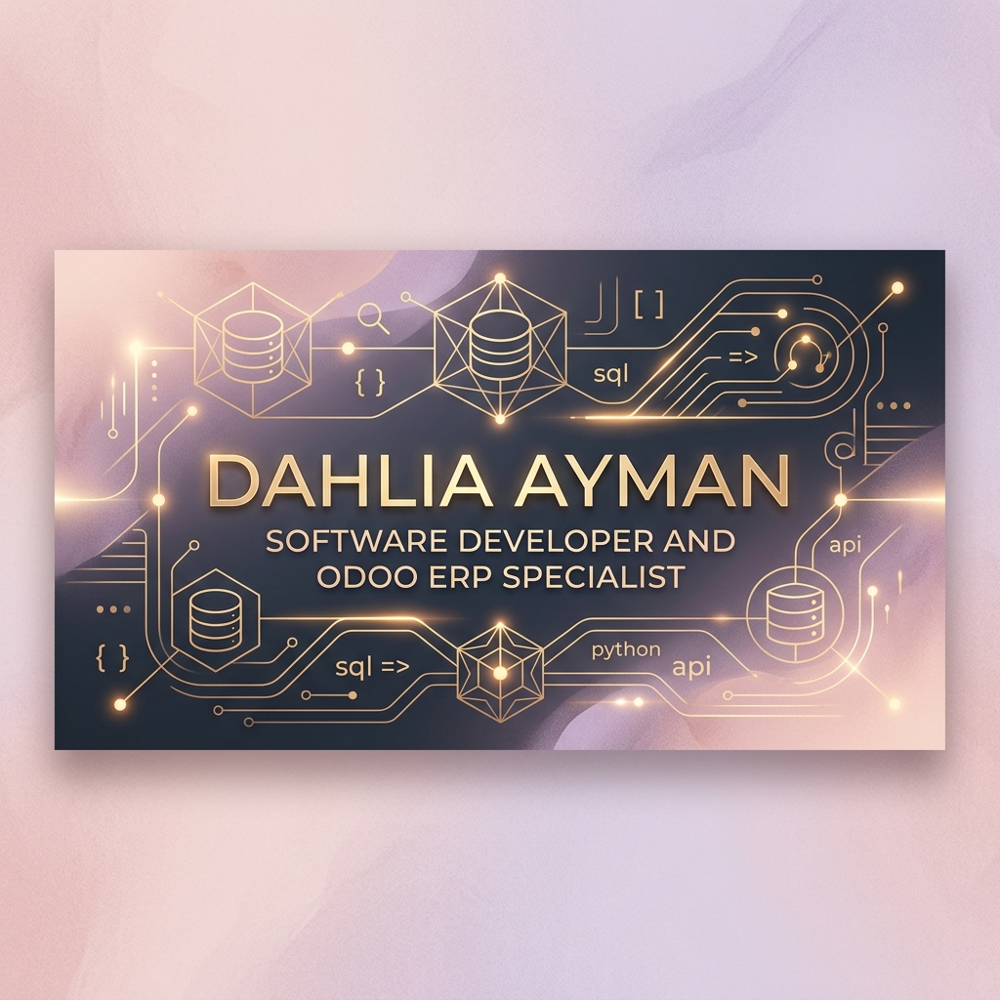

  

    

  <h1>
    
  </h1>

  

    <strong>Software Developer | Odoo ERP Specialist | Full-Stack Developer</strong>
  

  

    
    
    
  

---

### About Me

Hello! I am **Dahlia Ayman**, a **Software Developer** specializing in **Odoo ERP Systems (v17 to v19), Custom Module Architecture, and Full-Stack Web Engineering**. I combine clean code principles with robust database design to deliver sophisticated, enterprise-grade business applications.

* **Primary Specialization:** Odoo ERP (v17 to v19), Python Backend Engineering, Relational Database Architecture.
* **Core Competencies:** Business Process Automation, Custom ORM Models, QWeb Reporting, RESTful APIs, and Modern Web Dashboards.
* **Engineering Philosophy:** Clean architecture, performance optimization, elegant design, and continuous professional growth.

---

### Stack

#### **Programming Languages**

-F7DF1E?style=for-the-badge&logo=javascript&logoColor=black)

-6B5B95?style=for-the-badge&logo=xml&logoColor=white)

#### **Odoo ERP Ecosystem (v17 to v19)**
-714B67?style=for-the-badge&logo=odoo&logoColor=white)

-8D7B88?style=for-the-badge&logo=odoo&logoColor=white)

#### **Backend & Databases**

#### **Frontend & UI Frameworks**

#### **DevOps, Infrastructure & Tools**

---

### Work & Detailed Engineering Achievements

| Domain | Technical Achievements & Work Scope | Key Stack & Tools |
| :--- | :--- | :--- |
| **Odoo (v17 to v19) Enterprise Implementation** | Designed and executed complete ERP discovery cycles for trading enterprises, including module installation pipelines, master data settings, and end-to-end testing for Sales, Purchasing, Stock Inventory, and Financial Accounting. | `Python` `Odoo (v17-v19)` `PostgreSQL` `XML` |
| **Custom Module & ORM Architecture** | Engineered custom business models, field inheritance, automated record compute methods, custom security access controls (groups, rules), and tailored QWeb PDF invoice templates. | `Python` `Odoo ORM` `QWeb` `PostgreSQL` |
| **Python System Audits & Scripts** | Built automated Python scripts for environment inspection, module dependency validation, database audits (`odoo_audit.py`), and automated configuration rollout. | `Python 3` `Bash` `PostgreSQL` `JSON` |
| **Backend & API Integrations** | Architected REST API endpoints and RPC interfaces connecting external applications with Odoo backend databases and third-party systems. | `FastAPI` `Node.js` `REST API` `JSON-RPC` |
| **Full-Stack Application Development** | Built responsive frontend web application interfaces and modern dashboard portals integrated with backend database services. | `React` `JavaScript` `TypeScript` `Tailwind` |

*Note: Engineering work spans both open repositories and enterprise client systems maintained within private organization environments.*

---

  Designed with elegance for Dahlia Ayman

<!-- Badge unlock commit -->
